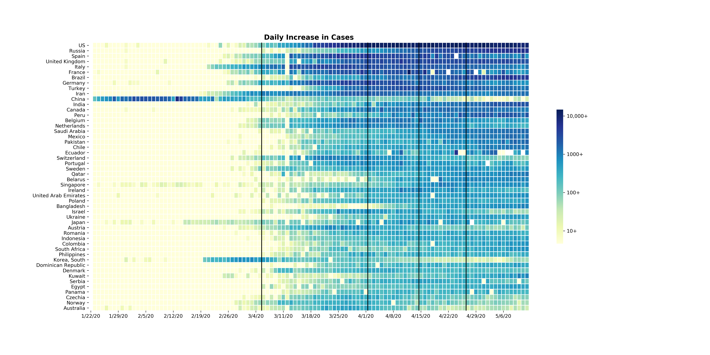

# 2019 Novel Coronavirus COVID-19 Daily Updates

This Project provides daily updates about the cases of Covid19 pandemic spread around the globe. The data is provided by
the Johns Hopkins University Center for Systems Science and Engineering (JHU CSSE). The Project give daily information about 
the topics. 

* Worldwide cases of spread 
* Major countries with most number of Covid19 cases
* Trajectory of spread in Major countries.
* Momentum of Spread (Based on rolling mean)
* Covid19 cases in China (in detail)

For daily updates please visit the link [COVID-19 Daily Updates](https://bit.ly/2QWmrYm)

<<<<<<< HEAD
=======
<b>Visual Dashboard (desktop):</b> 
https://www.arcgis.com/apps/opsdashboard/index.html#/bda7594740fd40299423467b48e9ecf6
  
<b>Visual Dashboard (mobile):</b> 
http://www.arcgis.com/apps/opsdashboard/index.html#/85320e2ea5424dfaaa75ae62e5c06e61
  
<b>Lancet Article:</b> 
[An interactive web-based dashboard to track COVID-19 in real time](https://doi.org/10.1016/S1473-3099(20)30120-1)
  
<b>Provided by Johns Hopkins University Center for Systems Science and Engineering (JHU CSSE):</b> 
https://systems.jhu.edu/
  
<b>Data Sources:</b> 
* World Health Organization (WHO): https://www.who.int/  
* DXY.cn. Pneumonia. 2020. http://3g.dxy.cn/newh5/view/pneumonia.   
* BNO News: https://bnonews.com/index.php/2020/02/the-latest-coronavirus-cases/   
* National Health Commission of the People’s Republic of China (NHC):  
 http://www.nhc.gov.cn/xcs/yqtb/list_gzbd.shtml  
* China CDC (CCDC): http://weekly.chinacdc.cn/news/TrackingtheEpidemic.htm  
* Hong Kong Department of Health: https://www.chp.gov.hk/en/features/102465.html  
* Macau Government: https://www.ssm.gov.mo/portal/  
* Taiwan CDC: https://sites.google.com/cdc.gov.tw/2019ncov/taiwan?authuser=0  
* US CDC: https://www.cdc.gov/coronavirus/2019-ncov/index.html  
* Government of Canada: https://www.canada.ca/en/public-health/services/diseases/coronavirus.html  
* Australia Government Department of Health: https://www.health.gov.au/news/coronavirus-update-at-a-glance  
* European Centre for Disease Prevention and Control (ECDC): https://www.ecdc.europa.eu/en/geographical-distribution-2019-ncov-cases 
* Ministry of Health Singapore (MOH): https://www.moh.gov.sg/covid-19
* Italy Ministry of Health: http://www.salute.gov.it/nuovocoronavirus
* 1Point3Arces: https://coronavirus.1point3acres.com/en
* WorldoMeters: https://www.worldometers.info/coronavirus/
* COVID Tracking Project: https://covidtracking.com/data. (US Testing and Hospitalization Data. We use the maximum reported value from "Currently" and "Cumulative" Hospitalized for our hospitalization number report ed for each state.)
>>>>>>> dcd4181613f512a6f75249fc77b63286aebe7271

